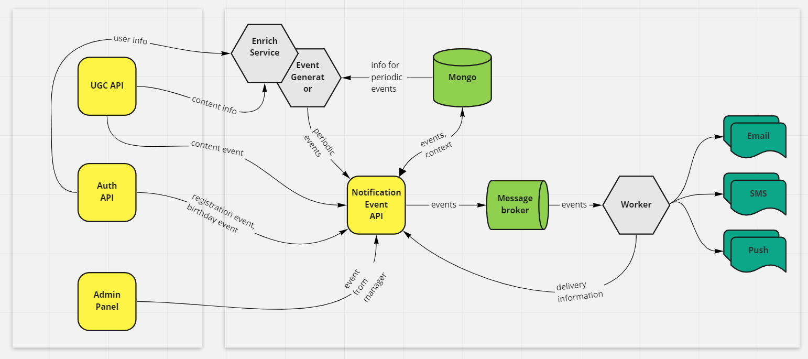
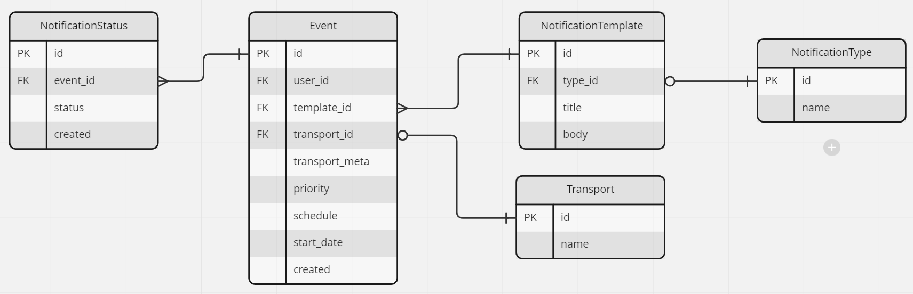

# Описание архитектуры сервиса нотификаций

## Связь компонентов
[Ссылка на Miro](https://miro.com/welcomeonboard/VGJIcHM5MXZIdVFQM1JscFBVNTRpWXJiSFIxMEFrZGpKRDRjU05Wck5XZXZ5RkllQUhHZEhJd2pORGF3NmFaQ3wzNDU4NzY0NTI5MDgxMzEwMDYx?share_link_id=551609151149)


## Схема базы данных
[Ссылка на Miro](https://miro.com/welcomeonboard/ZkpwbFRqYTB1dlZDVTk0UDdnSXJhVzdNSEVabk4zRGl0MjNYZk9memhIQXlnT2ZIaEtRTFdrT2MzdGVSaXY3QXwzNDU4NzY0NTI5MDgxMzEwMDYx?share_link_id=406306079554)


## Модели данных Notification API
### Входящие
```json
{
    "event_type": event_type,
    "created_dt": created_dt,
    "schedule": "5 4 * * *",
    "start_dt": null,
    "priority": 1,
    "payload": {
        "user": [user_id_1, user_id_2, ...],
        "content": [movie_id_1, movie_id_2, ...]
    }
}
```
где event_type представлен для типов событий:
- вышла новая серия
- лайк комментария
- реклама новинок
- напоминание об отложенных

### Исходящие (подготовленные для воркера)
```json
{
    "event_type": event_type,
    "created_dt": created_dt,
    "transport_type": ["email", "sms", "push"],
    "priority": 1,
    "payload": {
        "user": [
          {
            "user_id": user_id,
            "last_name": last_name,
            "first_name": first_name,
            "email": email,
            "birthday_date": birthday_date
          }, ...
        ],
        "content": [
          {
            "movie_id": movie_id,
            "season": null,
            "episode": null,
            "release_date": release_date
          }, ...
        ]
    }
}
```

## Описание работы
### Notification Event API
1) Notification Event API (в дальнейшем просто API) является единой точкой входа для событий, по которым надо делать рассылку. 
Представляет собой асинхронный FastAPI-сервис с одним эндоинтом для принятия событий 
по шаблону из пункта `Модели данных Notification API - Входящие`.
2) После получения события API дополняет информацию из Auth API + UGC API и формирует конечную модель.
3) Записывает данные в БД.
4) Отсылает на воркер через шину RabbitMQ.
5) В данном проекте для генерации начальных событий будет написан генератор событий вместо доработки Auth API + UGC API + Admin Panel.

### Генератор периодических событий
1) Этот сервис так же, как и Notification Event API, является асинхронным FastAPI-сервис в связке с Celery как планировщиком.
2) Данные для планирования берутся из БД.
3) Планировщик должен уметь добавлять таски с динамически построенным расписанием 
(вычитывается из полей start_day, schedule в формате cron).
4) Celery при срабатывания расписания передает информацию генератору-API,
тот, в свою очередь, передает данные в Notification Event API.

### Шина данных RabbitMQ
1) Принимает информацию от Notification Event API и пересылает ее в воркер.
2) Имеет несколько очередей, разделенных по приоритетам уведомлений (поле priority).

### Воркер
1) Представляет собой обычный python-сервис, работающий в бесконечном цикле.
2) Асинхронно вычитывает разные очереди и в зависимости от типа посылает уведомления.

## Вопросы
1) Стоит ли заводить в указанную БД таблицы для хранения данных из п.1?
2) Для групп рассылки и индивидуальных получателей можно завести таблицу receivers,
где для групп получателей будем заведен единый id, для индивидуальных там же присвоен свой id,
тогда API будет проверять есть ли group_id со всеми этими пользователями и, если нет, создавать новую группу.
3) Где описать логику отсылки уведомлений в зависимости от типа (sms, push, email) - 
для них должны быть отдельно стоящие сервисы или всем должен заниматься воркер?
